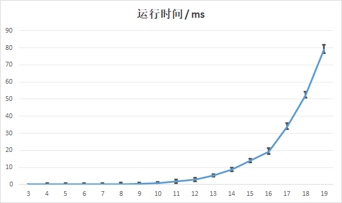
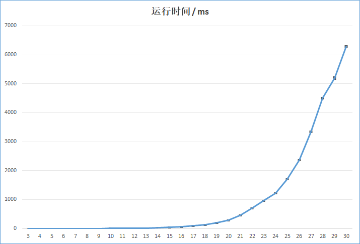
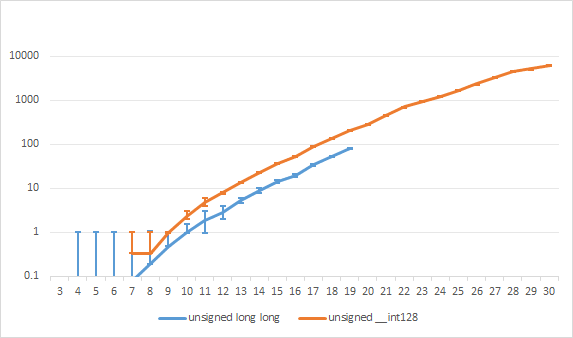

## 原理

枚举数字 $i$ 出现的次数 $c_i$，检查 $\displaystyle\sum_{i=1}^9 i^nc_i$ 的数位是不是这样的模式。

时间复杂度 $O(n^9)$.

## 运行时间

$f = 2.6 \mathrm{GHz}$ 下，

`unsigned long long` 版本（$T=30$）：



`unsigned __int128` 版本（$T=3$）：



对数坐标对比：



## 代码

为了效率，写了像古神一样的代码。  
调不动。根本调不动。

```cpp
#pragma GCC optimize(2)
#pragma GCC optimize(3)
#pragma GCC optimize("Ofast")
#pragma GCC optimize("-ffast-math")
#pragma GCC optimize("unroll-loops")
#pragma GCC target("avx2")

#include <bits/stdc++.h>
using namespace std;

typedef unsigned __int128 ull;
// typedef unsigned long long ull;
typedef unsigned __int128 u128;

constexpr int maxn = 30;
int n;
int ncnt[10], scnt[10];
int rest[10];  // *已经*对数字i分配完成后，剩余未分配的位数
ull s[10];    // *已经*对数字i分配完成后的总立方和
u128 pown[10];
ull pow10[maxn + 1];
// pow10[x] = 10^x, pown[x] = x^n
ull m, M;

inline ull qpow(ull a, int b) {
    ull ans = 1;
    while (b) {
        if (b & 1) ans *= a;
        a *= a;
        b >>= 1;
    }
    return ans;
}

unsigned char buf[maxn];
inline bool check(ull s) {
    memset(scnt, 0, sizeof(scnt));
    for (int i=1; i<=n; i++) {
        ull r = s / 10, 
            d = s - ((r<<1) + (r<<3));
        if (!s || ++scnt[d] > ncnt[d]) {
            return false;
        }
        buf[i] = d;
        s = r;
    }

    for (int i=n; i>=1; i--){
        putchar(buf[i] + '0');
    }
    putchar('\n');
    return true;
}

#define _lp0() for (ncnt[0]=0,rest[0]=n; rest[0]>=0; ncnt[0]++,rest[0]--)
#define _lp(x) for (ncnt[x]=0,rest[x]=rest[x-1],s[x]=s[x-1]; rest[x]>=0; ncnt[x]++,rest[x]--,s[x]+=pown[x])
#define _cutm(x) if (s[x]+rest[x]*pown[9] < m) break;
#define _cutM(x) if (s[x] > M) continue;
#define _rec(x, stmt) _lp(x) {_cutm(x);_cutM(x);stmt}

inline int hell_loop() {
    int ans = 0;
    _lp0(){
        _cutm(0); _cutM(0);
        _rec(1,_rec(2,_rec(3,_rec(4,_rec(5,_rec(6,_rec(7,_rec(8,{
            ncnt[9] = rest[8];
            ull ss = s[8]+ncnt[9]*pown[9];
            ans += check(ss);
        }))))))))
    }
    return ans;
}

inline int proc() {
    pow10[0] = 1;
    for (int i = 1; i <= n+1; i++) {
        pow10[i] = pow10[i - 1] * 10;
    }
    
    for (int i = 0; i <= 9; i++) {
        pown[i] = qpow(i, n);
    }
    
    m = pow10[n - 1];
    M = pow10[n] - 1;
    
    return hell_loop();
}

int main() {
    freopen("in.txt", "r", stdin);
    scanf("%d", &n);
    printf("N = %d\n", n);
    proc();
    return 0;
}
```
