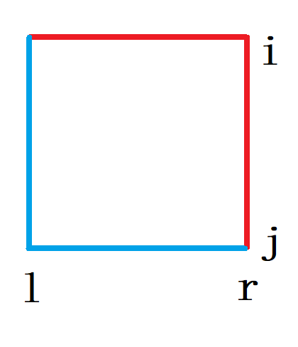
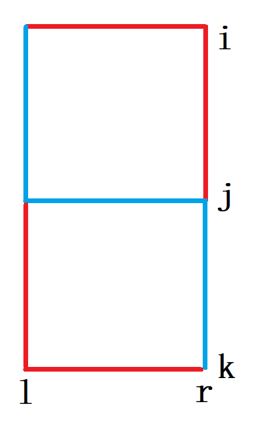

## [P9521[JOISC2022] 京都观光](https://www.luogu.com.cn/problem/P9521)

网格图，第 $i$ 行的边权全为 $a_i$，第 $j$ 列的边权全为 $b_i$，问 $(1, 1)$ 到 $(H, W)$ 的最短路。

考虑一次挪动。

{width="200px"}

选蓝线时有

$$a_i(r-l)+b_r(j-i) > b_l(j-i)+a_j(r-l)$$

整理得

$$\frac{b_r-b_l}{r-l} > \frac{a_j-a_i}{j-i}$$

这是一个斜率式，然而它既不满足最优性原理，字母又太多，于是考虑联立消元。

{width="200px"}

选蓝线时有

$$\frac{a_k-a_j}{k-j}>\frac{b_r-b_l}{r-l} > \frac{a_j-a_i}{j-i}$$

于是我们只需要保留 $a, b$ 的下凸壳即可。保留下凸壳之后，由于斜率递增，我们发现（1）式符合最优性原理了。每次根据斜率走一步即可。

:::details AC Code

```cpp
#include <bits/stdc++.h>
using namespace std;

typedef long long ll;
#define int ll

const int maxn=1e5+100;

inline int cmp_slope(
		int arr1[], int i1, int j1,
    	int arr2[], int i2, int j2){
    // (arr1[j1]-arr1[i1])/(j1-i1) - (arr2[j2]-arr2[i2])/(j2-i2)
	return (arr1[j1]-arr1[i1]) * (j2-i2) 
	     - (arr2[j2]-arr2[i2]) * (j1-i1);
}

struct convex {
	int arr[maxn];
	int sta[maxn];
	int top;
	
	bool check(int i1, int i2, int i3){
		return cmp_slope(arr, i1, i2, arr, i2, i3) < 0;
//		return (arr[i3]-arr[i2])*(i2-i1) > (arr[i2]-arr[i1])*(i3-i2);
	}
	
	void insert(int i){
		while (top>=2 && !check(sta[top-1], sta[top], i)){
			top--;
		}
		sta[++top] = i;
	}
} a, b;

signed main(){
	ios::sync_with_stdio(0);
	cin.tie(0);
	
	int h, w;
	cin >> h >> w;
	
	for (int i=1; i<=h; i++){
		cin >> a.arr[i];
		a.insert(i);
	}
	
	for (int i=1; i<=w; i++){
		cin >> b.arr[i];
		b.insert(i);
	}
	
	int x=a.top, y=b.top;
	int ans=0;
	while (x>1 && y>1){
//		printf("x=%d, y=%d, d=%d\n", x, y, ans);
		int i=a.sta[x-1], j=a.sta[x],
			l=b.sta[y-1], r=b.sta[y];
//		printf("i=%d, j=%d, l=%d, r=%d\n", i, j, l, r);
		if (cmp_slope(b.arr,l,r, a.arr,i,j) > 0){
			ans += a.arr[j]*(r-l);
			y--;
		} else {
			ans += b.arr[r]*(j-i);
			x--;
		}
	}
	
	ans += a.arr[1] * (b.sta[y]-1);
	ans += b.arr[1] * (a.sta[x]-1);
	
	cout << ans;
	
	return 0;
}
```

:::

## [P1248 加工生产调度](https://www.luogu.com.cn/problem/P1248)

设 $T(S,t)$ 为完成 $S$ 中任务，$B$ 比 $A$ 额外等待 $t$ 秒的最少时间。

$$T(S, t)=a_i+min_{i \in S}\left\{ T(S \setminus\{i\}, b_i+\operatorname{pos}(t-a_i)) \right\}$$

其中 $\operatorname{pos}(x)=\max\{0, x\}$。

$i$ 在 $j$ 之前，

$$
\begin{align*}
T(S, t)&=a_i + T(S \setminus\{i\}, b_i+\operatorname{pos}(t-a_i)) \\
&=a_i+a_j+T(S \setminus\{i, j\}, b_j+\operatorname{pos}(\operatorname{pos}(t-a_i)-a_j))
\\
\text{let } t_{i,j}&=b_j+\operatorname{pos}(\operatorname{pos}(t-a_i)-a_j)\\
&=\max\{b_j+b_i+t-a_i-a_j, b_j+b_i-a_j, b_j\} \\
&= b_i+b_j-a_i-a_j+\max\{t, a_i, a_i+a_j-b_i\}
\end{align*}
$$
$i$ 在 $j$ 之后，
$$
t_{j,i} = b_i+b_j-a_i-a_j+\max\{t, a_j, a_i+a_j-b_j\}
$$

于是

$$
\begin{align*}
t_{i,j}\le t_{j,i} &\Leftarrow \max\{a_i, a_i+a_j-b_i\} \le \max\{a_j, a_i+a_j-b_j\} \\
&\Leftrightarrow a_i+a_j+\max\{-a_j, -b_i\} \le a_i+a_j+\max\{-a_i, -b_j\}\\
&\Leftrightarrow \min\{a_j, b_i\} \ge \min\{a_i, b_j\}
\end{align*}
$$

直接排序会 E 掉，但是我们考虑如果 $a_i$ 比其他所有值更小，那么 $\forall j, \min\{a_j, b_i\} \ge \min\{a_i, b_j\}$，$i$ 一定排在最前。同理如果 $b_i$ 比其他所有值更小，$i$ 一定排在最后。

确定 $i$ 之后把 $i$ 标记为已选，再在未选的点决策即可。

知道结论之后很快能做出来。

:::details AC Code

```cpp
#include <bits/stdc++.h>
using namespace std;

const int maxn=1010; 

struct item{
    int i, v;
    bool typ;
    bool operator < (const item &other) const{
        return v<other.v;
    }
} items[maxn*2];
int a[maxn], b[maxn];
bool vis[maxn];
vector<int> li[3];

int main(){
    ios::sync_with_stdio(0);
    cin.tie(0);
    cout.tie(0);
    
    int n;
    cin >> n;
    for (int i=1; i<=n; i++){
        cin >> a[i];
        items[i] = {i, a[i], 0};
    }
    for (int i=1; i<=n; i++){
        cin >> b[i];
        items[i+n] = {i, b[i], 1};
    }
    
    stable_sort(items+1, items+2*n+1);
    
    for (int i=1; i<=2*n; i++){
        if (vis[items[i].i]){
            continue;
        }
        li[items[i].typ].push_back(items[i].i);
        vis[items[i].i] = true;
    }
    reverse(li[1].begin(), li[1].end()); 
    
    int at=0, bt=0;
    for (int typ=0; typ<=1; typ++){
        for (int i: li[typ]){
            at += a[i];
            bt = max(bt, at) + b[i];
        }
    }
        
    cout << bt << '\n';
    
    for (int typ=0; typ<=1; typ++){
        for (int i: li[typ]){
            cout << i << ' ';
        }
    }
    return 0;
}
```

:::

感谢《数学花园漫游记》让我在小学已经知道了这个问题的解法。

## 反悔贪心题

两行数，选 $k$ 个数，约束：如果选了一个数，它上面的也必须选。

### 法 1

划分成两部分。第一部分， $a_i<b_i$；第二部分，$a_i \ge b_i$。

设 $F(k)$ 为第一部分选 $k$ 个数的最大值，设 $G(k)$ 为第二部分选 $k$ 个数的最大值。

对于 $G(k)$，贪心选前 $k$ 大的数即可。

对于 $F(k)$，我们需要证明：至多只有一列选了一个数。

---
证明：设两列分别为

$$
a\quad b\\
c\quad d
$$

不妨设 $a\le b$，于是 $a\le b<d$。
于是 $a+b<b+d$。

---

于是我们把列按照和排序。如果 $k$ 为奇数，再贪心在第一列剩下的数选即可。

最终答案为 $\max\limits_{i=0}^{k} F(i)+G(k-i)$，由于 $G(i)$ 是凸的，可以在 $\operatorname{O}(n\log n)$ 内卷出来，但是比较麻烦。

### 法 2

反悔贪心。

每次两种决策：

1. 一列 $+1$；
2. 一列 $+2$，一列 $-1$。

证明：

我们先考虑一个较弱的情况。

1. 一列 $+1$；
2. 一列 $+2$，一列 $-1$；
3. 两列 $+1$，一列 $-1$。

容易发现它涵盖了所有的差异不大于 $3$ 的情况。

设 $OPT_k$ 为 $k$ 时的最优解，即证 $\exists OPT_{k-1}, OPT_k$ 使得 $OPT_k \Delta OPT_{k-1} \le 3$。

考虑反证法。设 $\min| OPT_{k-1}\Delta OPT_k | = m \ge 4$。

设 $G = OPT_k \setminus OPT_{k-1}$, $$O = OPT_{k-1} \setminus OPT_k$$

由于 $|G|-|O|=1, |G|+|O| \ge 4$，$|G|, |O| \ge 2$。

分类讨论：

1. 若 $G, O$ 都存在同列的数
   $$G_1 \quad O_1 \\ G_2 \quad O_2$$
   由最优性可知 $G_1+G_2 \ge O_1+O_2$ 且 $G_1+G_2 \le O_1+O_2$，  
   于是 $G_1+G_2 = O_1+O_2$。  
   此时可以让 $O_1, O_2$ 改选 $G_1, G_2$ 缩小 $m$ 值，与 $m$ 最小矛盾。
2. 若 $G$ 存在同列的数，$O$ 不存在同列的数
   $$G_1 \quad O_1 \quad O_2\\
   G_2 \quad X_1 \quad X_2$$
   （$X$ 表示都不选）  
   此时 $G_1+G_2 = O_1+O_2$，由 1 同理。  
   再如
   $$G_1 \quad B_1 \quad O_2\\
   G_2 \quad O_1 \quad X_1$$
   （$B$ 表示都选了）
   也是同理的。

3. 若 $O$ 存在同列的数，$G$ 不存在同列的数
4. 若 $G, O$ 都不存在同列的数

这两种情况也是同理的。

接下来我们证明最优解不可能由两列 $+1$，一列 $-1$ 的情况得出。设三个数分别为 $x_1, x_2, x_3$。

假设只有两列 $+1$，一列 $-1$ 的情况最优，则其一定比只加一个更优，即

$$
\begin{cases}
x_1+x_2-x_3 > x_1\\
x_1+x_2-x_3 > x_2
\end{cases}
$$

矛盾。

$\square$
