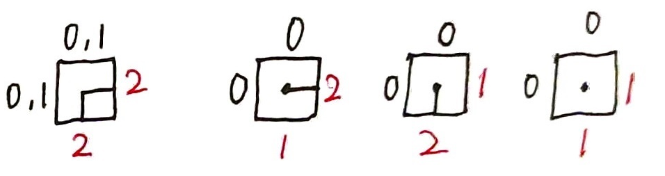
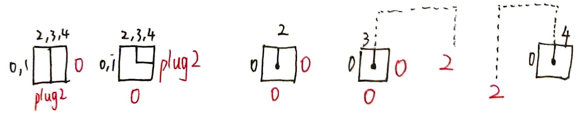

我们先不管清空的最终局面。

观察样例不难发现：命题“一个非空的最终局面合法”等价于“初始有蛇的所有格子都被占满了，且没有两个端点相邻”。

充分性和必要性都是显然的，读者自证不难。

由于题目中有对 $10^9+7$ 取模，猜想答案有可能大于 $10^9+7$，如果直接枚举，就算剪枝也会 T 飞。

我们发现只有已决策点和未决策点分界线上的状态才有可能影响我们的决策，于是考虑合并所有分界线上状态相同的局面。

于是等同于插头 DP。如果你不知道这是什么，请先做[模板题](https://www.luogu.com.cn/problem/P5056)。

## 插头设计

$0$ - 无插头且相邻格子不为端点；  
$1$ - 无插头且相邻格子为端点；  
$2$ - 有插头且该插头与端点相连；  
$3, 4$ - 不与端点相连的左、右括号插头。

图示：


## 状态转移

一共有 $24$ 种转移方式。

### Case 0


```cpp
if (!isok[i][j]){
    if (plug1<=1 && plug2<=1){
        insert(stateclr, cnt);
    }
    return;
}
```

### Case 1, 2, 3, 4



```cpp
if (plug1<=1 && plug2<=1){
    // x-
    // |
    if (isok[i+1][j] && isok[i][j+1]){
        insert(add2(stateclr, j, 3, 4), cnt);
    }
    
    if (!plug1 && !plug2){
        // x-
        if (isok[i][j+1]){
            insert(add2(stateclr, j, 1, 2), cnt);
        }
        // x
        // |
        if (isok[i+1][j]){
            insert(add2(stateclr, j, 2, 1), cnt);
        }
        // x
        insert(add2(stateclr, j, 1, 1), cnt);
    }
    return;
}
```

### Case 5, 6, 7, 8, 9



```cpp
if (plug2>=2 && plug1<=1){
    // |
    // x
    // |
    if (isok[i+1][j]){
        insert(add2(stateclr, j, plug2, 0), cnt);
    }
    // |
    // x-
    if (isok[i][j+1]){
        insert(add2(stateclr, j, 0, plug2), cnt);
    }
    // |
    // x
    if (!plug1){
        if (plug2==3){
            stateclr = sets(stateclr, find_right(state, j), 2);
        } else if (plug2==4){
            stateclr = sets(stateclr, find_left(state, j), 2);
        }
        insert(add2(stateclr, j, 1, 1), cnt);
    }
    return;
}
```

### Case 10, 11, 12, 13, 14


```cpp
if (plug1>=2 && plug2<=1){
    // -x-
    if (isok[i][j+1]){
        insert(add2(stateclr, j, 0, plug1), cnt);
    }
    // -x
    //  |
    if (isok[i+1][j]){
        insert(add2(stateclr, j, plug1, 0), cnt);
    }
    // -x
    if (!plug2){
        if (plug1==3){
        // +---+
        // |   |
        // +-x *
            stateclr = sets(stateclr, find_right(state, j-1), 2);
        } else if (plug1==4){
        // +-+
        // | |
        // | +-x
        // *
            stateclr = sets(stateclr, find_left(state, j-1), 2);
        }
        insert(add2(stateclr, j, 1, 1), cnt);
    }
    return;
}
```

### Case 15


```cpp
if (plug1==2 && plug2==2){
    //  |
    // -x
    insert(stateclr, cnt);
}
```

### Case 16, 17


```cpp
if (plug1==2 && plug2==3){
    //  +---+
    //  |   |
    // -x   *
    //   or
    // +---+
    // |   |
    // |  -x
    // *
    insert(sets(stateclr, find_cc(state, j), 2), cnt);
    return;
}
```

### Case 18, 19


```cpp
if (plug1==3 && plug2==2){
    // +---+
    // |   |
    // | | |
    // +-x *
    //  or
    // +-+
    // | | |
    // | +-x
    // *
    insert(sets(stateclr, find_cc(state, j-1), 2), cnt);
    return;
}
```

### Case 20


```cpp
if (plug1==4 && plug2==3){
    // +-+ +-+
    // | | | |
    // | +-x 
    insert(stateclr, cnt);
    return;
}
```

### Case 21


```cpp
if (plug1==4 && plug2==3){
    // +-+ +-+
    // | | | |
    // | +-x 
    insert(stateclr, cnt);
    return;
}
```

### Case 22


```cpp
if (plug1==4 && plug2==4){
    // +-----+
    // | +-+ |
    // | | | |
    // | | +-x 
    //   *
    insert(sets(stateclr, find_left(state, j-1), 4), cnt);
}
```

### Case 23


```cpp
if (plug1==3 && plug2==4){
    // +-+
    // | |
    // +-x
    can_clear = true;
    return;
}
```

### Code

:::details

```cpp
#include <bits/stdc++.h>
using namespace std;

typedef long long ll;
#define int ll

const int maxn=15, mod=1e9+7;


int n, m;
const int bits=3, mask=(1<<bits)-1;  // 状压位宽
const int LP=3, RP=4;  // 左右括号


unordered_map<int, int> umap1, umap2;
auto *pre=&umap1, *dp=&umap2;
bool isok[maxn][maxn];
bool can_clear;

inline void roll(){
    // 滚动数组 
    swap(pre, dp);
    dp->clear();
}

inline void insert(int x, int y){
// printf("\t");
// debug(-1, -1, x, y);
    (*dp)[x] += y;
    (*dp)[x] %= mod;
}

namespace statecompress {
    inline int at(int x, int i){
        // 取下标 
        return (x>>(i*bits)) & mask;
    }
    
    inline int clr(int x, int i){
        // 置零 
        return x & ~(mask<<(bits*i));
    }
    
    inline int add(int x, int i, int a){
        // 设值，需保证已经置零 
        return x | (a<<(bits*i)); 
    }

    inline int sets(int x, int i, int a){
        return add(clr(x, i), i, a);
    }
    
    inline int clr2(int x, int i){
        return clr(clr(x, i-1), i);
    }
    
    inline int add2(int x, int i, int a0, int a1){
        return add(add(x, i-1, a0), i, a1);
    }

    inline int find_right(int state, int j){
        int sta=0;  // 只用记录栈深度就行
        for (int k=j; k<=m; k++){
            int plug=at(state, k);
            if (plug == LP){
                sta++;
            } else if (plug == RP) {
                sta--;
                if (!sta){
                    return k;
                }
            }
        }
        
        return -1;
    }
    
    inline int find_left(int state, int j){
        int sta=0;
        for (int k=j; k>=0; k--){
            int plug=at(state, k);
            if (plug == RP){
                sta++;
            } else if (plug == LP){
                sta--;
                if (!sta){
                    return k;
                }
            }
        }
        
        return -1;
    }
    
    inline int find_cc(int state, int j){
        return (at(state, j) == LP) ? find_right(state, j) : find_left(state, j);
    } 
    
    char debugcharset[6]=".o-()";
    inline void debug(int i, int j, int x, int cnt){
        printf("I: %d, J: %d, STATE: ", i, j);
        while (x){
            putchar(debugcharset[x&mask]);
            x >>= bits;
        }
        printf(", CNT: %d\n", cnt);
    }
}
using namespace statecompress;


void work(int i, int j, int state, int cnt){
    // 0-空插头
    // 1-邻位有蛇头
    // 2-单插头
    // 3-左括号插头
    // 4-右括号插头 
    int plug1=at(state, j-1), plug2=at(state, j);
    int stateclr=clr2(state, j);
    
    if (!isok[i][j]){
        if (plug1<=1 && plug2<=1){
            insert(stateclr, cnt);
        }
        return;
    }
    
    if (plug1<=1 && plug2<=1){
        // x-
        // |
        if (isok[i+1][j] && isok[i][j+1]){
            insert(add2(stateclr, j, 3, 4), cnt);
        }
        
        if (!plug1 && !plug2){
            // x-
            if (isok[i][j+1]){
                insert(add2(stateclr, j, 1, 2), cnt);
            }
            // x
            // |
            if (isok[i+1][j]){
                insert(add2(stateclr, j, 2, 1), cnt);
            }
            // x
            insert(add2(stateclr, j, 1, 1), cnt);
        }
        return;
    }
    
    if (plug1>=2 && plug2<=1){
        // -x-
        if (isok[i][j+1]){
            insert(add2(stateclr, j, 0, plug1), cnt);
        }
        // -x
        //  |
        if (isok[i+1][j]){
            insert(add2(stateclr, j, plug1, 0), cnt);
        }
        // -x
        if (!plug2){
            if (plug1==3){
                // +---+
                // |   |
                // +-x *
                stateclr = sets(stateclr, find_right(state, j-1), 2);
            } else if (plug1==4){
                // +-+
                // | |
                // | +-x
                // *
                stateclr = sets(stateclr, find_left(state, j-1), 2);
            }
            insert(add2(stateclr, j, 1, 1), cnt);
        }
        return;
    }
    
    if (plug2>=2 && plug1<=1){
        // |
        // x
        // |
        if (isok[i+1][j]){
            insert(add2(stateclr, j, plug2, 0), cnt);
        }
        // |
        // x-
        if (isok[i][j+1]){
            insert(add2(stateclr, j, 0, plug2), cnt);
        }
        // |
        // x
        if (!plug1){
            if (plug2==3){
                stateclr = sets(stateclr, find_right(state, j), 2);
            } else if (plug2==4){
                stateclr = sets(stateclr, find_left(state, j), 2);
            }
            insert(add2(stateclr, j, 1, 1), cnt);
        }
        return;
    }
    
    if (plug1==2 && plug2==2){
        //  |
        // -x
        insert(stateclr, cnt);
    }
    
    if (plug1==2 && plug2==3){
        //  +---+
        //  |   |
        // -x   *
        //   or
        // +---+
        // |   |
        // |  -x
        // *
        insert(sets(stateclr, find_cc(state, j), 2), cnt);
        return;
    }
    
    if (plug1==3 && plug2==2){
        // +---+
        // |   |
        // | | |
        // +-x *
        //  or
        // +-+
        // | | |
        // | +-x
        // *
        insert(sets(stateclr, find_cc(state, j-1), 2), cnt);
        return;
    }
    
    if (plug1==4 && plug2==3){
        // +-+ +-+
        // | | | |
        // | +-x 
        insert(stateclr, cnt);
        return;
    } 
    
    if (plug1==3 && plug2==4){
        // +-+
        // | |
        // +-x
        can_clear = true;
        return;
    }
    
    if (plug1==3 && plug2==3){
        // +-----+
        // | +-+ |
        // | | | |
        // +-x *
        insert(sets(stateclr, find_right(state, j), 3), cnt);
        return; 
    }
    
    if (plug1==4 && plug2==4){
        // +-----+
        // | +-+ |
        // | | | |
        // | | +-x 
        //   *
        insert(sets(stateclr, find_left(state, j-1), 4), cnt);
    }
} 


signed main(){
    ios::sync_with_stdio(0);
    cin.tie(0);
    cout.tie(0);
    
    cin >> n >> m;
    int fullmask=(1<<(bits*(m+1)))-1;
    for (int i=1; i<=n; i++){
        char s[maxn];
        cin >> s+1;
        for (int j=1; j<=m; j++){
            isok[i][j] = (s[j]=='x');
        }
    }
    
    (*dp)[0] = 1;
    for (int i=1; i<=n; i++){
        roll();
        for (auto [state, cnt]: *pre){
            insert((state<<bits)&fullmask, cnt);
        }
        
        for (int j=1; j<=m; j++){
            roll();
            for (auto [state, cnt]: *pre){
//                debug(i, j, state, cnt);
                work(i, j, state, cnt);
            }
        }
    }
    
    int ans=can_clear;
    for (auto [state, cnt]: *dp){
        int x=state;
//        while (x){
//            putchar(debugcharset[x&mask]);
//            x >>= bits;
//        }
//        printf(": %d\n", cnt);
        ans += cnt;
        ans %= mod;
    }
    
    cout << ans;
    
    return 0;
}
```
:::