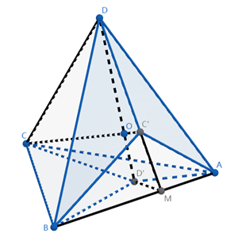
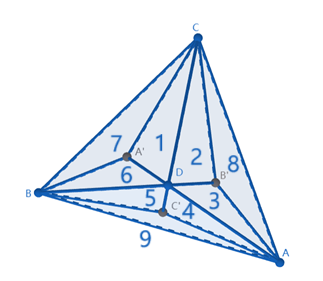
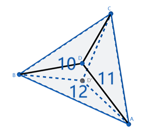

## T1

已知四面体 $ABCD$ 中，与 $A, B, C, D$ 相对的面分别为 $\alpha, \beta, \gamma, \delta$，四面体内有一点 $O$，$A', B', C', D'$ 分别为 $AO, BO, CO, DO$ 与 $\alpha, \beta, \gamma, \delta$ 的交点. 分别连接 $A', B', C', D'$ 与其所在的三角形的三个顶点，将每个三角形分割为三个小三角形.

（1）求证：
$$\frac{S_{\triangle A C' D }}{S_{\triangle A C D'}}=\frac{S_{\triangle B C' D}}{S_{\triangle B C D'}}$$

（2）现在，我们以如下规则在四面体表面游走：在分割出的 $12$ 个小三角形中，从一个三角形 $\Delta_1$ 开始，每次选择一个与 $\Delta_i$ 有公共边的 $\Delta_{i+1}$，直至游走回 $\Delta_1$. 设在游走过程中共游走过 $n$ 个小三角形，且 $\forall\{i,j,k\}\subseteq\{1,2,\ldots n\},\Delta_i,\Delta_j,\Delta_k$ 不全共面.

求证：$S_{\Delta_1} S_{\Delta_3} \dots S_{\Delta_{n-1}}=S_{\Delta_2} S_{\Delta_4} \dots S_{\Delta_n}$；或者，如果你看得懂连乘符号：
$$\prod_{1\le i\le n}^{2\mid i} S_{\Delta_i} = \prod_{1\le i\le n}^{2\nmid i} S_{\Delta_i}$$

### T1 解答

（1）

由于 $C', D' \in \text{平面 } CDO$，$CD', DC'$ 共面.  
设 $CD' \cap DC' = M$，因为 $M \in \text{平面 } ABD, \text{平面 } ABC$，所以 $M \in AB$.  
于是有

$$\frac{S_{\triangle BC'D}}{S_{\triangle AC'D}}
= \frac{S_{\triangle BMD} - S_{\triangle BMC'}}{S_{\triangle AMD} - S_{\triangle AMC'}}
= \frac{BM}{AM} = \frac{S_{\triangle BCD'}}{S_{\triangle ACD'}}$$

（2）俯视图：

 

如上图给三角形编号，不难发现符合题意的游走顺序只有 2 种（对称的算同一种）：

$$
\begin{align*}
& 1 \to 2 \to 3 \to 4 \to 5 \to 6 ~~ (\to 1)\\
& 1 \to 2 \to 8 \to 11 \to 12 \to 9 \to 5 \to 6 ~~ (\to 1)
\end{align*}
$$

对于第一种，

$$
\frac{S_1}{S_6} \cdot \frac{S_3}{S_2} \cdot \frac{S_5}{S_4}
= \frac{S_{11}}{S_{12}} \cdot \frac{S_{12}}{S_{10}} \cdot \frac{S_{10}}{S_{11}} = 1;
$$

对于第二种，

$$
\frac{S_1 S_8 S_{12} S_5}{S_2 S_{11} S_9 S_6}
= \frac{S_1 S_5 S_3}{S_2 S_6 S_4} \cdot \frac{S_8 S_{12} S_4}{S_{11} S_9 S_3} = 1.
$$

## T2

有单调递增的连续函数 $f:\mathbb{R}\rightarrow\mathbb{R}$，$k>1$，$x_1,x_2$ 分别为方程 $m=f(x_1),m=kf(x_2)$ 的解，$g(m)=x_1-x_2$ 单调递减.

（1）$g(m)$ 的定义域是否可以为 $\mathbb{R}$？给出判断并说明理由.

（2）定义 $f(x)\gg g(x)$ ，当且仅当存在 $x_0$ 使得 $\forall x>x_0,f(x)>g(x)$.  
$\qquad$ ① $f(x)\gg a^x$ 是否一定对所有 $a$ 成立？给出判断并说明理由.  
$\qquad$ ② 若 $g(m)\ll w$ 对任意 $w>0$ 成立，求证：$f(x)\gg a^x$.

### T2 解答

（1）不存在.

设 $h(x)$ 为 $f(x)$ 的反函数. 此时，$g(x) = h(x) - h\left(\dfrac{x}{k}\right)$. 由于 $f(x)$ 单调递增，$h(x)$ 也单调递增.  
于是，$g(1) = h(1)- h\left(\dfrac{1}{k}\right) > 0 = g(0)$，与 $g(x)$ 单调递减矛盾，因此不存在.

（2）① 不一定.

令 $h(x) = \ln x + \ln\ln x ~(x>1)$，则

$$
\begin{align*}
g(x) &= h(x) - h\left(\dfrac{x}{k}\right) \\
&= \ln k - \ln\left( 1 - \frac{\ln k}{\ln x} \right)
\end{align*}
$$

单调递减. 但是由于 $h(x) > \ln x$，$f(x) < e^x$，即为反例.

② 证明：

> **引理** 对于任意 $A>B, m, n>0$，$mA^x \gg nB^x$  
> **证明**
> $$mA^x \gg nB^x
    \iff \left(\frac{A}{B}\right)^x>\frac{n}{m}
    \iff x > \log_{A/B}\left(\frac{n}{m}\right)$$

设 $\varphi(x) = h(k^x)$，设 $t=\log_k x$，于是 $g(x) = \varphi(t) - \varphi(t - 1)$.

对于任意 $w>0$，由于 $g(x) \ll w$，设 $t_0 = \ln x_0$，我们有

$$
\varphi(t+n) = \varphi(t) + \sum_{i=1}^{n} \varphi(t+i)-\varphi(t+i-1) < \varphi(t) + nw, \qquad t>t_0.
$$

设 $T>t_0$，$\displaystyle\max_{T \le t < T+1} \varphi(t) = M$，则  $\varphi(t) < \varphi(t-\lfloor t-T \rfloor) + w\lfloor t-T \rfloor \le M + w(t-T)$.

于是 $h(x) < M + w(\log_k x - T)$，  
即对于 $x>k^T, f(x) > C(w) k^{x/w} = C(w) (k^{1/w})^x$，其中 $C(w) = k^{T-M/w}$.

由于 $\gg$ 具有传递性，对于足够大的 $A$，令 $w = \log_A k$，存在常数 $C(w)$ 使得 $f(x) \gg cA^x \gg a^x$，得证.

## T4

星和流萤（游戏角色）正在看星星和萤火虫.

星在翁法罗斯学了一些***魔术技巧***，于是打算表演个魔术.

秘密基地的天空是一个无限的平面. 平面上的每个整点（横纵坐标都为整数的点）都有一颗星星. 星的魔术是这样的：

(1) 选择一颗星星，将这颗星星变成「茧」；  
(2) 过一只「茧」作一条直线，并把直线上的星星全部变成「茧」. 与此同时，上一步产
生的所有「茧」将变为萤火虫.

在这场魔术中，星会无限重复第 2 步，使得对于每一颗星星，总存在一个整数 $N$，使得这颗
星星在第 $N$ 步变成萤火虫.

在筑梦边境，筑梦是需要消耗命途能量的. 星可以花费 1 点代价，为所有方向增加 1 点充能.

星每作一个方向的直线，都会消耗这个方向的 1 点充能.  
求把所有星星都变成萤火虫的最小代价.

### T4 解答

显然代价 $c \ge 1$，下证这个下界能取到.

我们将第 2 步及之后每一步选取的茧称为“活动茧”. 不难发现活动茧序列与操作策略一一对应.

考虑如何将活动茧转移到另一个确定的点。

一种直接的想法是直接作连接两点的直线，然而 $c = 1$ 要求直线两两不平行. 于是考虑取一个中继点 $T$.

$T$ 必须满足以下三条约束：

$$
\begin{gather}
ST \nparallel l \in L, \\
TD \nparallel l \in L, \\
T \notin l \in L.
\end{gather}
$$

其中 $L$ 为使用过的直线集.

**引理 无限集与有限集的差集仍是无限集。**

- 过 $S$ 总是存在不与任意用过的直线平行的直线，满足约束 $(1)$  
- 直线 $m$ 上一定存在符合要求的 $T$ 满足约束 $(2)(3)$.

于是，为每一个点编号（如按照逆时针螺旋），每次转移到编号最小的星星处. 如此，编号为 $i$ 的点总会在 $2i$ 步内变为萤火虫.

## T3

在正 $n$ 边形 $A_1A_2\dots A_n$ 内（含边界，不含顶点）有一点 $P$，求

$$s = \sum_{k=1}^n \angle PA_kA_{k+1} \qquad (A_{n+1}=A_1)$$

的取值范围.

:::warning
本题尚未找到初等解法
:::

### T3 解答

建立复平面，设 $P: z, A_k: \omega^k, \omega=e^{2k\pi i / n}$.

由于 $\overrightarrow{A_kA_{k+1}}$ 一定在 $\overrightarrow{A_kP}$ 的顺时针方向，$\angle PA_kA_{k+1} = \arg(P-A_k) - \arg(A_{k+1} - A_k)$.

即 $s(z) = \sum \arg(z - \omega^k) + C = C + \Im \sum \ln(z-\omega^k)$.

由 $\sum \ln(z-\omega^k)$ 是全纯函数，可知 $s(z)$ 是调和函数，因此 $s(z)$ 没有极值点.

$P$ 在边界上时，由于 $s(P)$ 此时单调，取极限可得 $\dfrac{(n-1)(n-2)\pi}{2n} < s(P) < \dfrac{(n+1)(n-2)\pi}{2n}$.
