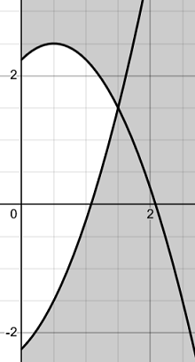
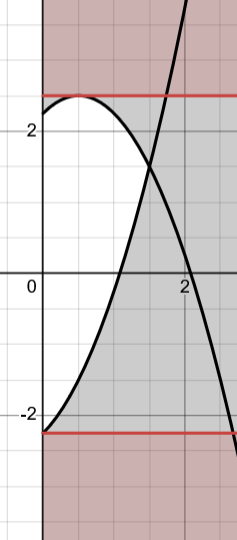

> 绝对值的 $\max$ 分解是指
> $$|a| = \max\{a, -a\}.$$
> 相比将含绝对值的不等式分解为两个不等式，这种分解方法更直接、更紧，且能借助能更好地解决含绝对值的不等式问题。

## 例 1

2024.11.6 提出 $\max$ 分解时的例题。

## 例 2

:::note 问题

若 $\forall m>0, m^2 + |m-a| \ge \dfrac{9}{4}$，求 $a$ 的取值范围。

:::

解：$\forall m>0$，

$$
\begin{align*}
    &\begin{align*}
    m^2 + |m-a|
    &= m^2+\max\{m-a,a-m\} \\
    &= \max\{m^2+m-a, m^2+a-m\} \ge \frac{9}{4},
    \end{align*}
\\
\iff& m^2+m-a \ge \frac{9}{4} \text{ 或 } m^2+a-m \ge \frac{9}{4}, \\
\iff& a \ge -m^2+m+\dfrac{9}{4} \text{ 或 } a\le m^2+m-\dfrac{9}{4}.
\end{align*}
$$

画出 $a\text{-}m$ 图象如下（阴影部分为满足不等式的部分）：

:::details 图象

:::

由于任意 $m>0$ 都要满足不等式，即一整条线 $a=a_0(m>0)$都要在区域之内。

于是符合要求的区域如下图红色部分：

:::details 图象

:::

即 $a\le-\dfrac{9}{4}$ 或 $a\ge\dfrac{5}{2}$.
