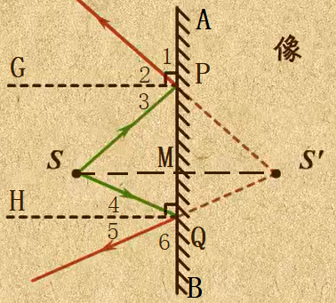

~~千万不要将此博文发给你的数学和物理老师~~

$\because GP\perp PQ$  
$\therefore \angle APG=\angle GPM=90\degree$  
$又\because \angle 1+\angle 2=\angle APG, \angle 3+\angle SPQ=\angle GPM$  
$\therefore \angle 1=\angle SPQ$  
$又\because AB, S'P交于点P$  
$\therefore \angle 1=\angle S'PQ$  
$\therefore \angle SPQ=\angle S'PQ$  
$同理，\angle SQP=\angle S'QP$  

$\because 在\triangle SPQ和\triangle S'PQ中$  
$\begin{cases} \angle SPQ=\angle S'PQ \\ PQ=PQ \\ \angle SQP=\angle S'QP\end{cases}$  
$\triangle SPQ≌\triangle S'PQ(ASA)$<!--LaTeX中的全等符号是反的，故直接打出-->  
$\therefore SP=S'P$  

$\because 在\triangle SPM和\triangle S'PM中$  
$\begin{cases} SP=S'P \\ \angle SPM=\angle S'PM \\ PM=PM\end{cases}$  
$\triangle SPM≌\triangle S'PM(SAS)$  
$\therefore SM=S'M, \angle SMP=\angle S'MP$  

$又\because M在SS'上$  
$\therefore \angle SMP+\angle S'MP=180\degree$  
$\therefore \angle SMP=\angle S'MP=180\degree \div 2=90\degree$  
$\therefore AB \perp SS'$  
