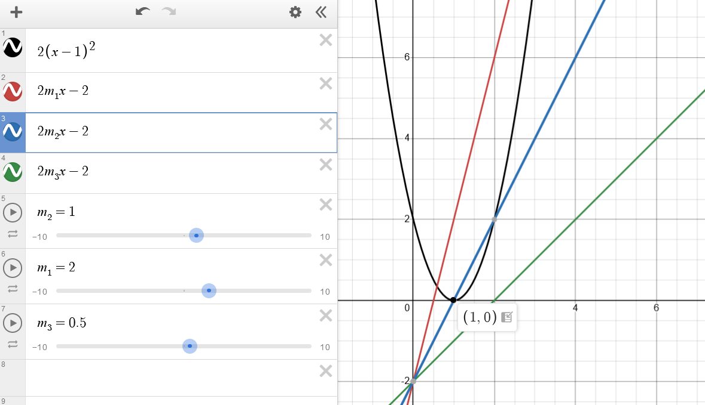

已知 $[x^2+(m-2)x+|x^2-(m+2)x+2|]_{\mathrm{min}} = 0$，求 $m$ 的取值范围。

---

考虑到 $x^2-(m+2)x+2$ 的正负难以确定，分类讨论不是好的选择。

注意到 $|x|=\max\{x, -x\}$，则有  
$~~~x^2+(m-2)x+|x^2-(m+2)x+2|$  
$=x^2+(m-2)x+\max\{x^2-(m+2)x+2, -[x^2-(m+2)x+2]\}$  
$=\max\{x^2+(m-2)x+[x^2-(m+2)x+2], x^2+(m-2)x-[x^2-(m+2)x+2]\}$  
$=\max\{2(x-1)^2, 2mx-2\}$

法1：  

由图象可知 $2m\times1-2\le0$，故 $m\in (-\infty, 1]$.

法2：  
$\max\{2(x-1)^2, 2mx-2\}\ge2(x-1)^2\ge0$.  
因此只需令两个等号同时成立即可。  
即 $x=1$ 时，$2(x-1)^2\ge2mx-2$，故 $m\in (-\infty, 1]$.
