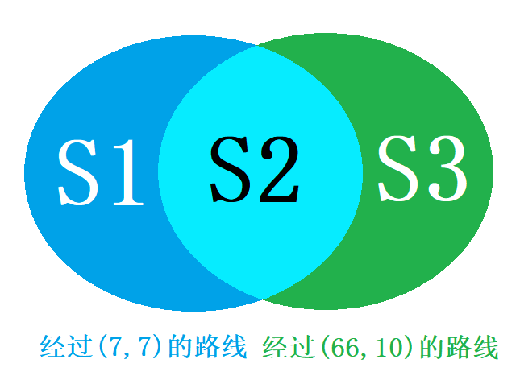

 

有一个网格，一个机器人需要从 $(0,0)$ 出发，每次只能向上或向右走一格，到达终点 $(100, 100)$.  
（1）若在 $(6, 6)$ 处有一个必需物资，机器人必须经过 $(6, 6)$，有多少种不同的走法能走到终点？  
（2）若 $(7, 7)$ 与 $(66, 10)$ 两点的网格坏了，不能经过这两点，有多少种不同的走法能走到终点？  
由于数字过大，保留答案中的所有组合数。  

::: tip 提示
考虑到排列组合是超纲的，并且这也不是今日FFMP主要考查的内容，因此在此给一些提示。  
1.这个问题的简化版：有一个网格，每次只能向上或向右走一格，问有多少种方法，能从 $(0, 0)$ 走到 $(m, n)$？这是一道小学奥数题，答案为 $C^m_{m+n}$（或等价的$C^n_{m+n}$）。你可以在你的推导中不加证明地使用这个结论。不用管这个 C 到底是什么符号。  
2.乘法原理：如果完成一件事需要分成多个步骤，每个步骤有多种方法，且这些步骤不会相互影响，那么完成这件事的方法数等于各步骤方法数之积。形式化地，若做第 $i$ 步有 $m_i$ 种不同的方法$(i=1,2,3,…,n)$，那么完成这件事共有 $n=m_1m_2m_2\cdots m_n$ 种不同的方法。 
:::

:::details 答案
（1）  
从 $(0, 0)$ 走到 $(6, 6)$ 共有 $C^{6}_{12}$ 种走法；从 $(6, 6)$ 走到 $(100, 100)$ 相当于从 $(0, 0)$ 走到 $(94, 94)$，共有 $C^{94}_{188}$ 种走法；  
由乘法原理得共有 $C^{6}_{12}\times C^{94}_{188}$ 种走法

（2）  

$S=C^{100}_{200}$  
$S_1+S_2 = C^7_7\times C^{93}_{186}$  
$S_2+S_3 = C^{10}_{76}\times C^{34}_{124}$  
$S_2 = C^7_7\times C^{3}_{72}\times C^{34}_{124}$  
$S-S_1-S_2-S_3 = C^{100}_{200} - C^7_7\times C^{93}_{186} - C^{10}_{76}\times C^{34}_{124} + C^7_7\times C^{3}_{72}\times C^{34}_{124}$
:::