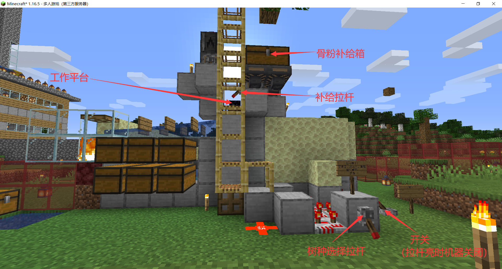

---  
title: 服务器工业设施使用说明书  
time: 2024/05/01  
---  

:::tip
在手机版上，点击“此页内容”可以查看目录。  
:::

**注：十分偏远或给服务器带来大量卡顿的机器将略过**  

## 村庄区  
  
### 刷石机#1  
产出：圆石  
地址：主世界 (10, 66, -274)  
用法：已废弃，但箱子里仍剩余大量圆石（700多组），可直接取用  
  
### 刷石机#2  
产出：圆石  
地址：主世界 (-18, 67, -305)  
用法：走上旋转楼梯，踩压力踏板即可  
注意事项：服务器连接不稳定，最好挂假人。绝对禁止在运行中退出游戏！！！请关注屏幕，确定不会因为死亡等原因意外卸载导致炸膛  
  
### 自动熔炉  
产出：石头、平滑石、玻璃等能烧制的物品  
地址：主世界 (-6, 65, -288)  
用法：在门口处的箱子内放入要烧制的物品，拉下旁边的拉杆。所有物品烧制完成后，关闭拉杆，去内部的箱子里面取产物。  
  
注意事项：  
1. 在某些时刻关机可能导致漏斗矿车无法启动，所以请在矿车在熔炉上时提前关闭拉杆  
2. 在自动熔炉启动时请保持熔炉在视野范围内  
检修方法：  
1. 若出现了注意事项1中的情况，可前往东南角（右下角）的检修口（一个木质活板门）轻推矿车，即可再次启动  
2. 若矿车意外停止（一般是因为违反了注意事项2），请轻推矿车，使其继续按顺时针方向运动  
  
### 刷铁机  
产出：铁锭  
地址：主世界 (50, 59, -254)  
用法：拉下头顶的拉杆，注意拉杆关闭时机器开启，反之亦然  
注意事项：仓库里有三大箱子铁块  
  
### 甘蔗、竹子机  
产出：甘蔗、竹子  
地址：主世界 (60, 64, -261)  
用法：拉下在机器背面的拉杆。同样注意：注意拉杆关闭时机器开启，反之亦然  
  
### 树场  
产出：原木、树叶、树苗、苹果  
地址：主世界 (-26, 64, -263)  
  
用法：  
1. 副手拿上树苗，将背包里除了主手所在的格子全部填满  
2. 选择树种，打开开关  
3. 爬上工作平台，确认补给箱内骨粉充足，打开补给拉杆  
4. 对着泥土，打开连点器，右键连点  
  
### 下界疣农场  
产出：下界疣  
地址：主世界 (-32 64, -290)  
用法：按按钮召唤矿车，坐上拿锄头，对准活板门较上部分，长按左键，按D键发车。循环一次后手拿下界疣，长按右键补种。  
  
### 刷花机  
产出：花，地狱菌  
地址：主世界(-4, 68, -305)  
用法：见开关旁告示牌。  
注意往左侧箱子内补充骨粉。  
  
## 山地区  
  
### 刷雪机  
产出：雪球  
地址：主世界 (268, 103, -163)  
用法：潜行进入踩上压力板，在面前的投掷器上填充石铲，对准石砖楼梯的缝隙一直按左键  
  
### 刷冰机  
产出：冰  
地址：主世界 (236, 127, -75)  
用法：  
1. 拿上至少精准采集、效率III（否则无法收集）的镐子（箱子里有一些）  
   注意不要穿深海探索者的靴子！  
2. 走到活板门上（确保走到最前面！），对准按钮中间，按下  
3. 长按左键（可使用长按左键+F3+T）  
  
  
出口、产物位置见如下二图，不要把船打掉。  
  
  
  
## 东海区  
### 袭击塔  
（略）  
  
## 地狱周边  
### 岩浆怪农场   
产出：岩浆膏  
地址：地狱门旁边  
用法：见[《公用结构》](MC-doc-head)   
### 杀凋机  
（略）  
  
## 西部基地区  
### 八核刷铁机  
地址：主世界 (-706, 64, 28)  
产出：铁锭  
## 地狱交通：西线  
### 黄金获取与交易中心（站台号piglin）  
地址：地狱交通西线，站台号piglin  
|楼层|项目|  
|:---:|:---:|  
|2F|猪人塔挂机点|  
|1F|传送门、猪人塔收集系统、信标|  
|B1|猪人塔收集系统、猪灵交易所输入|  
|B2|猪灵交易所收集系统|  
  
   
  
#### 猪人塔  
产出：金粒、金锭、经验  
用法：见[《公用结构》](MC-doc-head)   
  
打开木桶拿雪球，待岩浆块上刷猪人之后用雪球跳起来打右侧矿车上的猪人。  
接下来用抢夺III+横扫的剑打被引过来的猪人即可。  
箱子分配：最左侧：杂物箱；中间：金粒；最右侧：金锭与合成的金块  
> 注：需要长时间挂机时，为了防止玩家意外位移，请站在右后方的角落处。玩家吸到的一部分经验已能支持经验修补。  
  
   
  
#### 猪灵交易所  
输入：金锭  
输出：末影珍珠、线、下界石英、黑曜石、哭泣的黑曜石、火焰弹、皮革、灵魂沙、下界砖、光灵箭、沙砾、黑石、灵魂疾行附魔书、抗火药水  
  
### 末地（支线号end）见[地图](#末地区)  
### 猪肉塔（站台号pork）  
产出：皮革、猪肉  
地址：地狱交通西线，站台号pork  
用法：见[《公用结构》](MC-doc-head)   
在主世界端用铲子挖一个雪球  
从梯子上去，跳起来用雪球打矿车内的猪人  
用带横扫、抢夺的剑打被吸引过来的猪人  
### 烈焰人农场（支线号blaze）  
产出：烈焰棒  
地址：地狱交通西线，支线号blaze  
用法：见[《公用结构》](MC-doc-head)   
用带横扫、抢夺的剑打烈焰人，最好打脚部，不容易打到藤蔓。  
若意外破坏藤蔓，可从箱子里拿备用的藤蔓补上  
## 地狱交通：东线  
### 史莱姆农场（支线号slime）  
产出：黏液球  
地址：地狱交通东线，支线号slime（然而最好用的是鞘翅，往东北方向飞即可）  
用法：见[《公用结构》](MC-doc-head)   
产物位置：从挂机点走到路的尽头，跳下海面，再爬上梯子  
### 守卫者农场（slime支线）  
to be continued  
### 刷怪塔（站台号mob）   
产出：骨头、箭、火药、蜘蛛眼、腐肉等  
地址：地狱交通东线，站台号mob  
用法：见[《公用结构》](MC-doc-head)   
产物位置：从挂机点走到路的尽头，跳下海面  
## 地狱交通：南线  
### 女巫塔（站台号witch）   
产出：红石、荧石、糖、玻璃瓶  
地址：地狱交通南线，站台号witch  
用法：在地狱门外挂机即可  
## 地狱交通：北线  
### 凋灵骷髅农场  
（略）  
  
## 末地区  
地图（3D版）：  
  
地图（2D版）：  
  
### 刷沙机  
产出：混凝土粉末、沙子、砂砾、铁砧  
地址：见[地图](#末地区)  
用法略，在箱子中拿即可  
### 混凝土固化机  
输入：混凝土粉末  
输出：混凝土  
地址：见[地图](#末地区)  
用法：（待完善）  
### 小黑塔  
产出：经验、末影珍珠  
地址：见[地图](#末地区)  
用法：  
打开开关，用带横扫的剑打小黑  
1. 左侧音符盒为开关  
2. 右侧拉杆为主动释放掉落物开关  
3. 该小黑塔主要提供经验，末影珍珠请用背包吸取  
4. 会定期释放掉落物，此时小黑也将一同落进虚空，请耐心等待释放完成  
