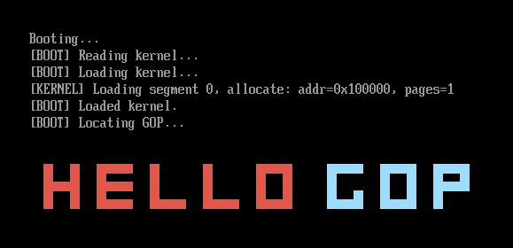

我知道你急着进入内核，但你先别急，现在进入内核还写不出 Hello world.

因此我们先将显示图形搞定。

## 获取 GOP

在 UEFI 开发中，GOP {.inline}
:::ruby Grand Old Party
（Graphics Output Protocol）
:::
是用于管理显示输出的核心协议。相比于 VGA，它支持的分辨率和它的灵活性都更高。 {.inline}

```c title="src/shared/graphics/gop.c"
// TODO: update newer code in blog

#include "gop.h"

#ifdef BOOTLOADER
EFI_GRAPHICS_OUTPUT_PROTOCOL *GOP;
#endif
UINT32 ScreenWidth=-1, ScreenHeight=-1;
UINT32 *fb;
// 退出 BootServices 之后 GOP 不可用，但是以上三项仍可用

void InitGOP(){
    EFI_GUID GopGuid = EFI_GRAPHICS_OUTPUT_PROTOCOL_GUID;
    EFI_STATUS status = BS->LocateProtocol(
        &GopGuid, NULL, (void**)&GOP
    );

    if (EFI_ERROR(status)){
        Err(L"[ERROR] Failed to locate GOP\r\n");
    }

    ScreenWidth = GOP->Mode->Info->HorizontalResolution;
    ScreenHeight = GOP->Mode->Info->VerticalResolution;
    fb = (UINT32*) GOP->Mode->FrameBufferBase;
}
```

也没什么好讲的，经历过这么多 UEFI 开发，读这个应该就和读英语差不多了。

有个!!浪费了我半天的!!小插曲，就是把 `(void**)&GOP` 打成了 `(void**)GOP`，结果触发了未定义行为，直接返回了个 `EFI_NOT_FOUND`，导致我调了半天。这个故事告诉我们抄代码一定要抄对。

## 实现画图库

接下来就可以直接通过写缓冲区来画图了。

:::tip
┌─── x  
│  
y
:::

```c
void DrawPixel(UINT32 x, UINT32 y, PIXEL color){
    if (x<0 || y<0 || x>=ScreenWidth || y>=ScreenHeight){
        return;
    }

    EFI_GRAPHICS_OUTPUT_BLT_PIXEL *pixel = &fb[y * ScreenWidth + x];
    pixel->Blue = color.Blue;
    pixel->Green = color.Green;
    pixel->Red = color.Red;
    pixel->Reserved = color.Reserved;
}
```

接下来，就可以自由发挥，添加你想要的功能。

```c
void DrawRect(UINT32 x1, UINT32 y1, UINT32 x2, UINT32 y2, PIXEL color){
    for (UINT32 x=x1; x<=x2; x++){
        for (UINT32 y=y1; y<=y2; y++){
            DrawPixel(x, y, color);
        }
    }
}

void DrawTextImage(CHAR8 *Image, PIXEL *ColorMap, UINT32 Unit, 
                   UINT32 StartX, UINT32 StartY){
    // ' ' 固定为透明
    int x=StartX, y=StartY;
    for (int i=0; Image[i]; i++){
        if (Image[i] == '\n'){
            x = StartX;
            y += Unit;
            continue;
        }
        
        if (Image[i] != ' '){
            DrawRect(x, y, x+Unit, y+Unit, ColorMap[Image[i]]);
        }
        x += Unit;
    }
}
```

## Shared

为了让 bootloader 可以访问到这个文件，在 bootloader 下新建 `gop.h` `gop.c`，分别 `#include` 对应的文件即可。就是这么朴实无华。

## 每日 Hello

```c title="src/bootloader/ootloader.c"
...

CHAR8 *Image = 
    "#  #  ####  #     #     ####    @@@@  @@@@  @@@@  \n"
    "#  #  #     #     #     #  #    @     @  @  @  @  \n"
    "####  ####  #     #     #  #    @     @  @  @@@@  \n"
    "#  #  #     #     #     #  #    @  @  @  @  @     \n"
    "#  #  ####  ####  ####  ####    @@@@  @@@@  @     \n";
PIXEL ColorMap[256];

EFI_STATUS EFIAPI 
efi_main(EFI_HANDLE ImageHandle, EFI_SYSTEM_TABLE *SystemTable) {
    ...

    PutStr(L"[BOOT] Locating GOP...\r\n");
    InitGOP();
    ColorMap['#'] = (PIXEL){73, 86, 228, 255};
    ColorMap['@'] = (PIXEL){254, 220, 156, 255};
    DrawTextImage(Image, Map, 10, 256, 256);

    ...
}

```

就可以看到第一个彩色的 Hello:

:::center

:::

## 番外：用 GOP 显示文字

我们可以用 64 位整数保存一个 8×8 的图像，于是可以把一个 ASCII 字体看作 `uint64_t FONT[128]`.

至于如何生成这个字体，见源代码的 **utils/fontdecoder/main.py**

```c title="print.c"
#include "print.h"
#include "font.h"

#define CHAR_WIDTH 8
#define CHAR_HEIGHT 8
#define PADDING 16
#define LINE_SPACING 4

int32_t w_scaling=1, h_scaling=1;
int32_t w_scaled=8, h_scaled=8;

#define LINE_HEIGHT (h_scaled + LINE_SPACING)

void set_scaling(int32_t w, int32_t h){
    w_scaling = w;
    h_scaling = h;
    w_scaled = CHAR_WIDTH * w;
    h_scaled = CHAR_HEIGHT * h;
}

void putchar_at(char c, uint32_t x, uint32_t y, PIXEL fg, PIXEL bg) {
    if (c > 127){
        c = ' ';
    }

    uint64_t glyph = FONT[c];
    for (uint32_t row = 0; row < CHAR_HEIGHT; row++) {
        for (uint32_t col = 0; col < CHAR_WIDTH; col++) {
            BOOLEAN b = (glyph >> (row * 8 + col)) & 1;
            DrawRect(x+col*w_scaling, y+row*h_scaling,
                     x+(col+1)*w_scaling-1, y+(row+1)*h_scaling-1,
                     b? fg: bg);
        }
    }
}

uint32_t cursor_x = PADDING, cursor_y = PADDING;
PIXEL fg_color = {255, 255, 255, 255},
      bg_color = {0};

void putchar(char c) {
    if (c == '\n') {
        cursor_x = PADDING;
        cursor_y += LINE_HEIGHT;
        return;
    }
    if (c == '\r'){
        cursor_x = PADDING;
        return;
    }
    if (c == 8/*BS*/){
        if (cursor_x >= PADDING + w_scaled){
            cursor_x -= w_scaled;
        }
        return;
    }

    if (cursor_y + LINE_HEIGHT > ScreenHeight - PADDING) {
        cursor_x = PADDING;
        cursor_y = PADDING;
        // TODO: 实现屏幕滚动
    } else if (cursor_x + w_scaled > ScreenWidth - PADDING) {
        cursor_x = PADDING;
        cursor_y += LINE_HEIGHT;
    }

    putchar_at(c, cursor_x, cursor_y, fg_color, bg_color);
    cursor_x += w_scaled;
}

void print(char *s) {
    for (int i=0; s[i]; i++){
        putchar(s[i]);
    }
}
```
