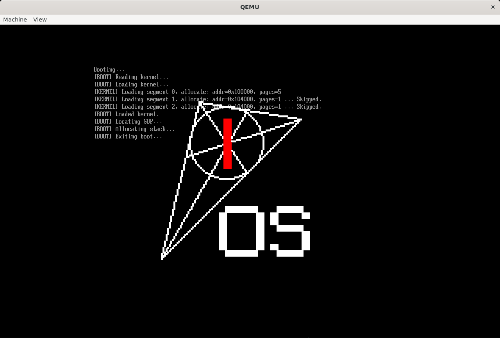

> 本节的任务并不像以前一样可以直接从标题看出来，所以我们简要介绍一下。  
> 在本节中，我们将完成引导阶段的最后一项工作：**退出 UEFI 环境、设置好内核运行所需的栈空间，并跳转进入我们的内核**。  

---

## 正式和 UEFI 说再见

`ExitBootServices` 是 UEFI 世界与裸机世界的分水岭。一旦退出，UEFI 提供的所有服务（包括内存分配、文件访问、打印输出等）将彻底失效，内核将完全接管硬件。

调用 `ExitBootServices` 先要获取内存布局。它也是经典的调用两次：第一次查询大小，第二次获取布局。

```c title="src/bootloader/exitboot.c"
#include "exitboot.h"

UINTN GetMapKey() {
    EFI_STATUS status;

    UINTN MapSize = 0, MapKey, DescSize;
    UINT32 DescVer;

    status = BS->GetMemoryMap(&MapSize, NULL, &MapKey, &DescSize, &DescVer);
    if (status != EFI_BUFFER_TOO_SMALL){
        Err(L"[ERROR] GetMemoryMap (size query) failed.\r\n");
    }

    MapSize += DescSize * 8;

    EFI_MEMORY_DESCRIPTOR *mem_map = (EFI_MEMORY_DESCRIPTOR*) Allocate(MapSize);
    if (!mem_map){
        Err(L"[ERROR] Failed to allocate memory map.\r\n");
    }

    status = BS->GetMemoryMap(&MapSize, mem_map, &MapKey, &DescSize, &DescVer);
    if (EFI_ERROR(status)){
        Err(L"[ERROR] GetMemoryMap (actual) failed.\r\n");
    }

    return MapKey;
}

void ExitBootDevices(EFI_HANDLE ImageHandle, UINTN MapKey){
    EFI_STATUS status = BS->ExitBootServices(ImageHandle, MapKey);
    if (EFI_ERROR(status)){
        Err(L"[ERROR] ExitBootDevices failed. Memory map changed?\r\n");
    }
}
```

## 分配栈

如之前所述，退出后此时我们必须确保一切资源都已经准备就绪。

UEFI 跳转到内核后，可能会留下一个不可靠或太小的堆栈。我们必须自己提供一块干净的、足够大的栈，否则一旦进入函数或中断就可能出现崩溃。

:::tip
* 栈是从高地址向低地址生长的，因此设置 `rsp = stack_top`
:::

```c
PutStr(L"[BOOT] Allocating stack...\r\n");
const UINTN
    MB = 0x100000,
    KernelStackSize = 0x8000,
    KernelStackPages = KernelStackSize / PageSize,
    KernelStackBase = 24*MB,  // [!code highlight]
    KernelStackTop = KernelStackBase + KernelStackSize;
AllocatePagesAt(KernelStackBase, KernelStackPages);
```

::::tip
我们可以通过输出之前获取的 `MemoryMap` 确定应该把栈放在哪里。

```c
// Will Change Memory Map
for (int i=0; i < MapSize/DescSize-8; i++){
    EFI_MEMORY_DESCRIPTOR* desc = (EFI_MEMORY_DESCRIPTOR*)
            ((UINT8*)mem_map + (i*DescSize));
    PrintDec(desc->Type);
    PrintHex(desc->PhysicalStart);
    PrintHex(desc->NumberOfPages);
    PutStr(L"\r\n");
}
```

:::details 内存布局（节选）

| 起始地址     | 起始地址 (换算)   | 页数 | 大小      | 类型编号 | 类型说明                         |
| ----------- | -------------- | ---- | -------- | ------- | ------------------------------- |
| `0x0`       | 0 B            | 1    | 4 KB     | 3       | `EfiBootServicesCode`           |
| `0x1000`    | 4 KB           | 159  | 546 KB   | 7       | `EfiConventionalMemory`         |
| `0x100000`  | 1 MB           | 5    | 20 KB    | 2       | `EfiLoaderCode`<br/>（我们的内核）|
| `0x105000`  | 1 MB + 20 KB   | 1787 | 6.98 MB  | 7       | `EfiConventionalMemory`         |
| `0x800000`  | 8 MB           | 8    | 32 KB    | 10      | `EfiACPIReclaimMemory`          |
| `0x808000`  | 8 MB + 32 KB   | 3    | 12 KB    | 7       | `EfiConventionalMemory`         |
| `0x80B000`  | 8 MB + 44 KB   | 1    | 4 KB     | 10      | `EfiACPIReclaimMemory`          |
| `0x810000`  | 8 MB + 64 KB   | 240  | 960 KB   | 10      | `EfiACPIReclaimMemory`          |
| `0x900000`  | 9 MB           | 3712 | 3.625 MB | 4       | `EfiBootServicesData`           |
| `0x1780000` | 23 MB + 512 KB | 128  | 512 KB   | 7       | `EfiConventionalMemory`         |
| `0x1800000` | 24 MB          | 8    | 32 KB    | 2       | `EfiLoaderCode`<br/>（我们的栈）  |
| `0x1808000` | 24 MB + 32 KB  | 9069 | ~35 MB   | 7       | `EfiConventionalMemory`         |

:::
::::

## 传递参数

这里，我们使用结构体指针传递参数。

```c title="src/shared/bootinfo.h"
#include <stdint.h>

#define MAGIC 0x00796c6665726946

typedef struct {
    uint32_t *framebuffer;
    uint32_t width;
    uint32_t height;
} GraphicsInfo;

typedef struct {
    uint64_t base_addr;
    uint64_t size;
} StackInfo;

typedef struct {
    uint64_t magic;
    GraphicsInfo graphics;
    StackInfo stack;
} BootInfo;
```

记得把 `kernel_entry` 函数改为 `void kernel_entry(BootInfo*)`！

## 一 二 三 跳

为了防止污染栈，设置 `rsp` 之后，我们不能再调用函数。因此，我们通过 `rdi` 传参（System V ABI），然后直接 `jmp` 跳转。

:::warning
删去之前桥接函数的 `__attribute__((ms_abi))`
:::

```c
__asm__ __volatile__ (
    "mov %[stack], %%rsp\n"
    "mov %[info], %%rdi\n"
    "jmp *%[entry]\n"
    :
    : [stack] "r"(stack_top),
      [info] "r"(boot_info),
      [entry] "r"(kernel_entry)
);
```

## 每日 Hello

让我们画个 logo：

```c title="src/kernel /kernel.c"
// 在 bootloader 中，为了和 UEFI 统一，使用了驼峰命名法
// 在此处就换回来了。

#include "../shared/bootinfo.h"
#include "gop.h"
#include "../shared/graphics/logo.h"

void kernel_main();

BootInfo boot_info;

void kernel_entry(BootInfo *bi) {
    boot_info = *bi;  // 需要自己实现 memcpy
    kernel_main();
}

void kernel_main(){
    if (boot_info.magic != MAGIC){
        while (1){
            __asm__ volatile ("hlt");
        }
    }

    InitGOPFrom(boot_info.graphics.framebuffer, 
                boot_info.graphics.width,
                boot_info.graphics.height);

    PIXEL map[256];
    map['@'] = (PIXEL){255, 255, 255, 255};
    map['R'] = (PIXEL){0, 0, 255, 255};
    int unit = 4;
    DrawTextImage(
        logo, map, unit, 
        (ScreenWidth-logo_size*unit)/2, 
        (ScreenHeight-logo_size*unit)/2);

    while (1){
        __asm__ volatile ("hlt");
    }
}
```



> 至此，我们终于从 UEFI 的摇篮中爬了出来，准备赤脚在硬件上奔跑了！
> :::right
> —— ChatGPT
> :::
