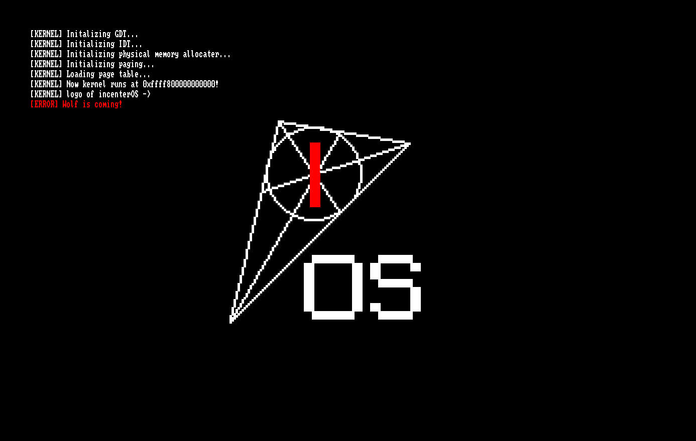

## 为什么需要虚拟内存

- 在 64 位系统中，我们可以访问 64 位的内存地址。物理地址无法支持绝大多数的访问。
- 随着内存的使用，内存碎片将会越来越多，必须重新映射才能连续地访问内存。
- 虚拟内存保证了两个程序访问的内存互不影响，只需要映射到不同的物理地址即可。

## 页表

如果直接储存映射的话，那些程序不使用的页会浪费大量的空间。因此，在 x86_64 中，我们使用一个动态开点的 5 层 512 叉线段树来存映射，即多级页表。

和普通的动态开点线段树相比，页表的结构有很大的不同：

- 页表的深度是确定的，因此可以通过分析二进制位来确定的索引，每 9 位为一级。
- 非叶节点会占用了一整页（4KB），其包含了所有子节点的信息（64b，页表项），因此 5 层的树只需要 4 级页表。
  - NOTE: $64\text{b} \times 512 = 4\text{KB}$

:::note
四级页表各有各的名字：PML4, PDP, PD, PT.
:::

## 分配页

需要注意的是：并非所有的页都是可用的。因此，我们需要用两个数组管理页，分别存储一页是否

- 可用，
- 被占用（已用或不可用）。

如何初始化这两个数组呢？好在，我们先前获取的 `MemoryMap` 还没有删掉。因此，我们将它塞进 `BootInfo`，传进内核。

```c title="src/shared/boot_info.h"
typedef struct {
    void *mem_map;
    uint64_t __i_forgot_its_name__;
    uint64_t desc_size;
} MemoryMapInfo;

typedef struct {
    ...
    MemoryMapInfo mm;
} BootInfo;
```

**记得把 `MemoryMapInfo` 传进 `BootInfo`**

:::tip

可以把一字节拆成 8 位，来节省空间。

```c title="src/kernel/bitarray.c"
#include "bitarray.h"
// typedef uint8_t* bit_array; in .h

void set_bit(bit_array arr, size_t idx){
    arr[idx / 8] |= 1 << (idx % 8);
}

void clear_bit(bit_array arr, size_t idx){
    arr[idx / 8] &= ~(1 << (idx % 8));
}

int test_bit(bit_array arr, size_t idx){
    return (arr[idx / 8] >> (idx % 8)) & 1;
}
```

:::

初始化的代码：

```c title="src/kernel/pmm_alloc.c"
#define RESERVED_PAGES ((1<<20) / PAGE_SIZE)
uint8_t page_bitmap[MAX_PAGE_COUNT / 8];  // 是否被占用（不可用或已分配）
uint8_t page_available[MAX_PAGE_COUNT / 8];  // 是否可用
size_t total_pages;

void pmm_init(const EFI_MEMORY_DESCRIPTOR *mem_map, 
              size_t count, size_t desc_size){
    total_pages = 0;
    memset(page_bitmap, 0xFF, sizeof page_bitmap);
    memset(page_available, 0, sizeof page_available);

    for (size_t i=0; i < count; i++){
        const EFI_MEMORY_DESCRIPTOR *desc = 
            (const EFI_MEMORY_DESCRIPTOR*) ((uint8_t*)mem_map + i * desc_size);

        if (desc->Type != EfiConventionalMemory){
            continue;
        }

        size_t start_page = desc->PhysicalStart / PAGE_SIZE;
        size_t len = desc->NumberOfPages;

        for (size_t p=0; p < len; p++){
            if (start_page + p >= MAX_PAGE_COUNT){
                break;
            }

            clear_bit(page_bitmap, start_page + p);
            set_bit(page_available, start_page + p);
            total_pages++;
        }
    }

    memset(page_available, 0, RESERVED_PAGES / 8);
    memset(page_bitmap, -1, RESERVED_PAGES / 8);
}
```

我们写一个最简单的页分配器，循环查找未分配的页。  
一个优化的方法是：每次从上次 alloc/free 的页开始搜索。

```c title="src/kernel/pmm_alloc.c"
...

static size_t last_pos = 0;

void* pmm_alloc_page(){
    for (size_t i = last_pos; i < MAX_PAGE_COUNT; i++){
        if (!test_bit(page_bitmap, i)){
            set_bit(page_bitmap, i);
            last_pos = i + 1;
            return (void*) (i * PAGE_SIZE);
        }
    }
    return NULL;
}

void pmm_free_page(size_t addr){
    size_t idx = addr / PAGE_SIZE;
    if (idx >= MAX_PAGE_COUNT){
        return;
    }

    if (!test_bit(page_available, idx)){
        return;
    }

    clear_bit(page_bitmap, idx);
    if (idx < last_pos){
        last_pos = idx;
    }
}
```

## 修改页表

我们先前说过：每个页表项包含了子节点的所有信息。因此，我们先看看页表项的结构。

```c
typedef union PageTableEntry {
    struct __attribute__((packed)) {
        uint64_t present   : 1;
        uint64_t writable  : 1;
        uint64_t user      : 1;
        uint64_t writethru : 1;
        uint64_t cache_dis : 1;
        uint64_t accessed  : 1;
        uint64_t dirty     : 1;  // For PT only
        uint64_t hugepage  : 1;  // For PD/PT entries
        uint64_t global    : 1;
        uint64_t ignored1  : 3;
        uint64_t addr      : 40;
        uint64_t ignored2  : 11;
        uint64_t no_exec   : 1;
    };
    uint64_t value;
} PageTableEntry;

typedef PageTableEntry* PageTable;
```

由于结构是相似的，我们可以用类似动态开点线段树的写法来写页表。  
众所周知，`get_subnode` 是动态开点线段树的一个重要函数。因此，我们先实现它。

```c title="src/kernel/paging.c"
PageTable alloc_table(){
    PageTable page = pmm_alloc_page();
    if (!page) {
        raise_err("[ERROR] Cannot alloc new page!");
    }

    memset(page, 0, PAGE_SIZE);
    return page;
}

PageTable get_or_alloc_table_of(PageTableEntry* entry, uint64_t flags) {
    if (!(entry->present)) {
        void *table = alloc_table();
        entry->value = ((uint64_t)table) | flags;
    }
    return (uint64_t*)(entry->value & ~(PAGE_SIZE-1));
}
```

接下来，就可以实现修改页表的功能了。

```c title="src/kernel /paging.c"
static PageTable kernel_pml4;

void map_page(uint64_t virt, uint64_t phys, uint64_t flags) {
    size_t pml4_index = PML4_IDX(virt);
    size_t pdpt_index = PDPT_IDX(virt);
    size_t pd_index   = PD_IDX(virt);
    size_t pt_index   = PT_IDX(virt);

    PageTable pdpt = get_or_alloc_table_of(kernel_pml4+pml4_index, PRESENT | WRITABLE);
    PageTable pd   = get_or_alloc_table_of(pdpt+pdpt_index, PRESENT | WRITABLE);
    PageTable pt   = get_or_alloc_table_of(pd+pd_index, PRESENT | WRITABLE);

    pt[pt_index].value = (phys & ~0xFFFULL) | flags;
}
```

## 映射

我们把内核和帧缓冲区都映射到正确的地方。

```c title="src/kernel/kernel.c"
void init_paging(){
    // 内核
    map_pages(0, 32*MB, 0, PRESENT | WRITABLE);  // 恒等
    map_pages(KERNEL_VIRT, 32*MB, 0, PRESENT | WRITABLE);  // 高地址

    // 帧缓冲区
    uint64_t fb_base = (uint64_t)(boot_info.graphics.framebuffer);
    uint64_t fb_size = boot_info.graphics.size_bytes;  // BI 新增项目
    map_pages(fb_base, fb_size, fb_base, PRESENT | WRITABLE);
    map_pages(FB_VIRT, fb_size, fb_base, PRESENT | WRITABLE);
}
```

## 每日 Hello

```c
print("[KERNEL] Initializing physical memory allocater...\n");
pmm_init(boot_info.mem.mem_map,
            boot_info.mem.count,
            boot_info.mem.desc_size);

print("[KERNEL] Initializing paging...\n");
paging_set_root();
init_paging();
print("[KERNEL] Loading page table...\n");
set_cr3();
print("[KERNEL] Now kernel runs at 0xffff800000000000!\n");  // 其实还没有
```



## 扩展：2MB 大页

我们之前的页表高度是固定的，这就引发了一些问题。例如，我们发现：如果把一段连续的大内存映射到连续的虚拟地址，会浪费很多页表项。

于是，我们可以启用大页，即让一个较浅的结点成为叶结点。

一个大页可以映射 2MB 的内存。如此，映射 1GB 的内存在叶节点上只需要花 $\dfrac{1\text{GB}}{2\text{MB}} \times 8\text{B} = 4\text{KB}$，对于我们的系统来说足够了。

要标记一个页表项是大页，只需把 `huge_page` 位置一即可。

```c title="src/kernel/paging.c"
// 2MB 大页
void map_huge_page(uint64_t virt, uint64_t phys, uint64_t flags){
    size_t pml4_index = PML4_IDX(virt);
    size_t pdpt_index = PDPT_IDX(virt);
    size_t pd_index   = PD_IDX(virt);

    PageTable pdpt = get_or_alloc_table_of(kernel_pml4+pml4_index, PRESENT | WRITABLE);
    PageTable pd   = get_or_alloc_table_of(pdpt+pdpt_index, PRESENT | WRITABLE);

    pd[pd_index].value = (phys & ~(HUGE_PAGE_SIZE-1)) | flags | HUGE_PAGE;
}

void map_pages(uint64_t virt_start, size_t bytes, uint64_t phys_start, uint64_t flags){
    virt_start &= ~(PAGE_SIZE-1);
    uint64_t off = 0;

    // 前散块
    for (; ((virt_start + off) & (HUGE_PAGE_SIZE-1)) && off < bytes; off += PAGE_SIZE){
        map_page(virt_start + off, phys_start + off, flags);
    }

    // 整块
    for(; off + HUGE_PAGE_SIZE <= bytes; off += HUGE_PAGE_SIZE) {
        map_huge_page(virt_start + off, phys_start + off, flags);
    }
    
    // 后散块
    for (; off < bytes; off += PAGE_SIZE){
        map_page(virt_start + off, phys_start + off, flags);
    }
}
```

还有一个问题：如果用一个小页去覆写大页，那么大页的其余部分的映射会丢失。因此，类似线段树地，我们写一个 `push_down` 函数：

```c title="src/kernel/paging.c"
static inline void push_down(PageTableEntry *pd_entry) {
    if (!pd_entry->hugepage) {
        return;
    }

    uint64_t old_value = pd_entry->value;
    pd_entry->value = 0; // 先清空条目
    
    uint64_t phys = old_value & ~(HUGE_PAGE_SIZE-1);
    uint64_t flags = old_value & 0xFFF; // 保留所有标志位
    flags &= ~HUGE_PAGE; // 确保清除大页标志
    
    PageTable pt = get_or_alloc_table_of(pd_entry, flags);

    for (int i = 0; i < ENTRY_COUNT; i++) {
        pt[i].value = (phys + i * PAGE_SIZE) | flags;
    }
}

void map_page(uint64_t virt, uint64_t phys, uint64_t flags) {
    // print("mapping ~~...\n");
    size_t pml4_index = PML4_IDX(virt);
    size_t pdpt_index = PDPT_IDX(virt);
    size_t pd_index   = PD_IDX(virt);
    size_t pt_index   = PT_IDX(virt);

    PageTable pdpt = get_or_alloc_table_of(kernel_pml4+pml4_index, PRESENT | WRITABLE);
    PageTable pd   = get_or_alloc_table_of(pdpt+pdpt_index, PRESENT | WRITABLE);

    push_down(pd+pd_index);  // [!code ++]
    PageTable pt   = get_or_alloc_table_of(pd+pd_index, PRESENT | WRITABLE);

    pt[pt_index].value = (phys & ~0xFFFULL) | flags;
}
```
