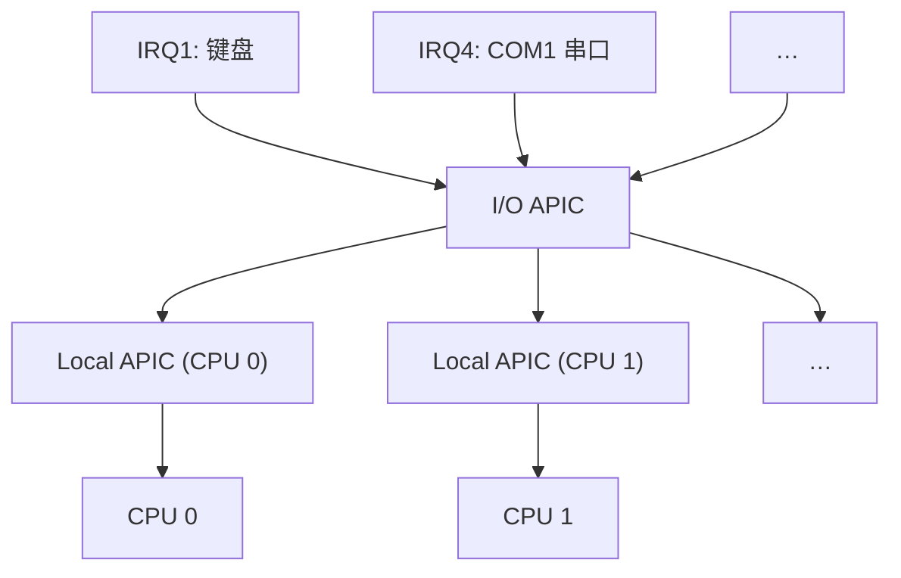

## APIC

接下来我们看到的中断，都是由 APIC（Advanced Programmable Interrupt Controller，高级可编程中断控制器）管理的了。APIC 的好处是它支持多核 CPU（虽然我们现在暂时用不到）。我们来看看它的结构：



我们下一章再和 I/O APIC 打交道，这一章，我们先讲 LAPIC 时钟。

## 读写 LAPIC 寄存器

我们使用 MMIO（Memory-Mapped I/O，内存映射 I/O）与 APIC 通信。APIC 会映射一片内存空间。我们可以通过读写这片内存的方法，读写 APIC 寄存器。

```c title="src/kernel/apic.h"
#define APIC_DEFAULT_BASE 0xFEE00000

static inline void apic_write(uint32_t reg, uint32_t val) {
    ((volatile uint32_t*)APIC_DEFAULT_BASE)[reg / 4] = val;  // 32b = 4B
}

static inline uint32_t apic_read(uint32_t reg) {
    return ((volatile uint32_t*)APIC_DEFAULT_BASE)[reg / 4];
}
```

记得在页表里面添加它的映射，否则不能正常读写。

```c
map_pages(APIC_DEFAULT_BASE, 0x1000, APIC_DEFAULT_BASE, PRESENT | WRITABLE);
```

## 初始化时钟

接下来，我们通过写寄存器的方式初始化时钟。

时钟的工作原理是这样的：有一个计数器，从一个初始值开始，每周期把它减 1。等到减为 0，就发出一个中断并重置计数器的值。因此，这个初始值与时钟中断的间隔成正比。我们之后还会调整它的值。

```c title="src/kernel/timer.c"
#define LAPIC_REG_TIMER        0x320
#define LAPIC_REG_TIMER_INIT   0x380
#define LAPIC_REG_TIMER_CURR   0x390
#define LAPIC_REG_TIMER_DIV    0x3E0

#define LAPIC_TIMER_MODE_PERIODIC (1 << 17)
#define LAPIC_TIMER_VECTOR 0x20

void init_lapic_timer() {
    apic_write(LAPIC_REG_TIMER_DIV, 0b0011); // Divide by 16

    apic_write(LAPIC_REG_TIMER, LAPIC_TIMER_VECTOR | LAPIC_TIMER_MODE_PERIODIC);

    apic_write(LAPIC_REG_TIMER_INIT, 1000000);  // 设置初始计数器
}
```

接下来，我们就可以编写 ISR 了。我们暂时就先输出一下时钟中断触发的次数。

```c title="src/kernel/timer.c"
int64_t time=0;

void timer_handler(uint8_t vec, void *regs){
    print("[TIMER] ");
    print_dec(time);
    print("\r");
    time++;
    apic_send_eoi();  // 必须
}

void init_timer(){
    init_lapic_timer();
    isr[LAPIC_TIMER_VECTOR] = timer_handler;
}
```

:::warning
`apic_send_eoi();` 是必须的，否则 APIC 不会发送下一个中断。

```c
#define APIC_EOI 0xB0

static inline void apic_send_eoi() {
    apic_write(APIC_EOI, 0);
}
```
:::

如此，你应该可以看到一个随时间不断增加的数字。这就成功了。
