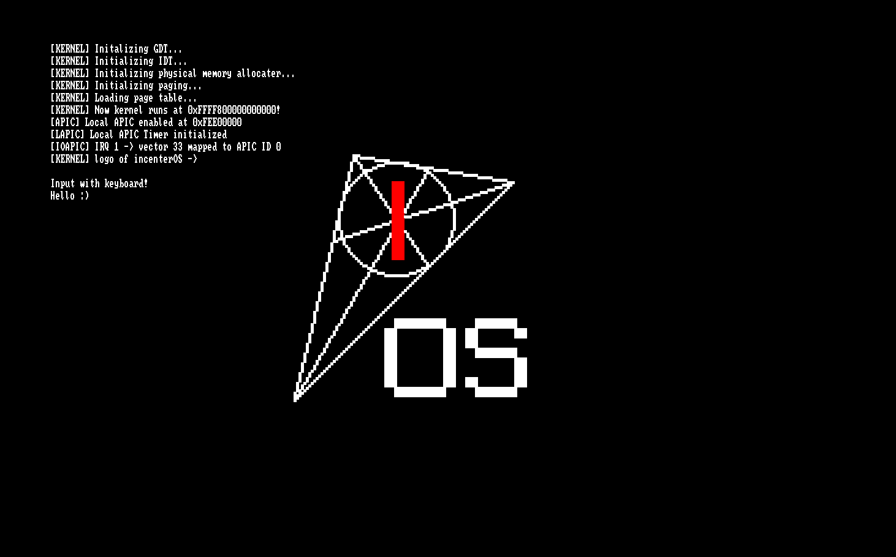

上一章说过这一章会讲 I/O APIC，现在就来了。

## I/O APIC 寄存器读写

I/O APIC 的寄存器读写与 Local APIC 略有不同。我们只在两个固定的内存地址中读写，其中一个选择要读写的寄存器，另一个对这个寄存器进行读写。

记得在页表中添加 `0xFEC00000` 一页的映射！

```c title="scr/kernel/apic.h"
#define IOAPIC_REGSEL  0xFEC00000
#define IOAPIC_WINDOW  0xFEC00010

inline void ioapic_write(uint8_t reg, uint32_t val) {
    *(volatile uint32_t*)IOAPIC_REGSEL = reg;
    *(volatile uint32_t*)IOAPIC_WINDOW = val;
}

inline uint32_t ioapic_read(uint8_t reg) {
    *(volatile uint32_t*)IOAPIC_REGSEL = reg;
    return *(volatile uint32_t*)IOAPIC_WINDOW;
}
```

## 映射 IRQ

I/O 设备不会直接发出中断，而是发出一个中断请求，经过 I/O APIC 转换之后变成中断。因此，我们仍然需要填表。

这里，我们主要填的是转换之后的中断向量已经要发送到的 CPU 编号。

```c
void ioapic_redirect_irq(uint8_t irq, uint8_t vector, uint8_t apic_id/*CPU*/) {
    uint8_t index = 0x10 + irq * 2;

    uint32_t low = vector;
    uint32_t high = ((uint32_t)apic_id) << 24;

    ioapic_write(index + 1, high); // high dword: APIC ID
    ioapic_write(index, low);      // low dword: vector & flags(0)

    print("[IOAPIC] IRQ "); print_dec(irq); print(" -> vector "); print_dec(vector); print(" mapped to APIC ID "); print_dec(apic_id); print("\n");
}
```

## 键盘中断

键盘的 IRQ 号是 1，于是可以如下映射：

```c title="src/kernel/keyboard.c"
#define KEYBOARD_VEC 0x21

void keyboard_handler(uint8_t vec, void *regs) {
    // TODO
    apic_send_eoi();
}


void init_keyboard(){
    ioapic_redirect_irq(1, KEYBOARD_VEC, 0);
    isr[KEYBOARD_VEC] = keyboard_handler;
}
```

那么，如何知道按下了哪个按键呢？我们可以在 `0x60` 端口读到键盘的扫描码。

:::details 端口 I/O
```c title="src/kernel/io.h"
static inline uint8_t inb(uint16_t port) {
    uint8_t ret;
    __asm__ volatile ("inb %1, %0" : "=a"(ret) : "Nd"(port));  // "a", "d" 表示使用 ax, dx 寄存器
    return ret;
}

static inline void outb(uint16_t port, uint8_t val) {
    __asm__ volatile ("outb %0, %1" : : "a"(val), "Nd"(port));
}
```
:::

## 显示字符

继续英语阅读。

```c title="src/kernel/keyboard.c"
#define LSHIFT_PRESS     0x2A
#define LSHIFT_RELEASE   0xAA
#define RSHIFT_PRESS     0x36
#define RSHIFT_RELEASE   0xB6
#define CAPSLOCK_PRESS   0x3A
#define CAPSLOCK_RELEASE 0xBA

const char scancode_table[2][128] = { {
    0, 27, '1', '2', '3', '4', '5', '6', '7', '8', '9', '0', '-', '=', 8,
    '\t', 'q', 'w', 'e', 'r', 't', 'y', 'u', 'i', 'o', 'p', '[', ']', '\n',
    0, 'a', 's', 'd', 'f', 'g', 'h', 'j', 'k', 'l', ';', '\'', '`',
    0, '\\', 'z', 'x', 'c', 'v', 'b', 'n', 'm', ',', '.', '/',  0, '*',
    0, ' '
}, {
    0, 27, '!', '@', '#', '$', '%', '^', '&', '*', '(', ')', '_', '+', 8,
    '\t', 'Q', 'W', 'E', 'R', 'T', 'Y', 'U', 'I', 'O', 'P', '{', '}', '\n',
    0, 'A', 'S', 'D', 'F', 'G', 'H', 'J', 'K', 'L', ':', '"', '~',
    0, '|', 'Z', 'X', 'C', 'V', 'B', 'N', 'M', '<', '>', '?',  0, '*',
    0, ' '
}};

uint8_t lshift, rshift, capslock;

char translate_scancode(uint8_t scancode) {
    lshift = lshift && (scancode != LSHIFT_RELEASE) || (scancode == LSHIFT_PRESS);  // 注意运算优先级
    rshift = rshift && (scancode != RSHIFT_RELEASE) || (scancode == RSHIFT_PRESS);
    capslock = capslock ^ (scancode == CAPSLOCK_RELEASE);

    if (scancode >= 128) {
        return 0;  // 忽略松开按键
    }

    uint8_t shift = lshift || rshift;
    if ('a' <= scancode_table[0][scancode] && scancode_table[0][scancode] <= 'z'){
        shift ^= capslock;
    }

    return scancode_table[shift][scancode];
}
```

然后我们如此处理：

```c title="src/kernel/keyboard.c"
void keyboard_handler(uint8_t vec, void *regs) {
    uint8_t scancode = inb(0x60);
    char c = translate_scancode(scancode);
    if (c) {
        putchar(c);
    }
    apic_send_eoi();
}
```

看看效果：


