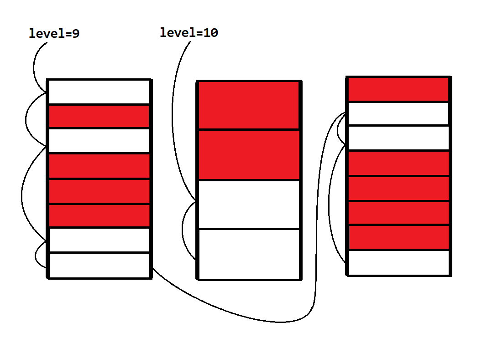

用 C 语言编程，没有 malloc 总是寸步难行。因此，今天我们就实现一个内核的 malloc！

## 结构

我们将内存切成长度为 $2^n$ 的小块，然后用链表将相同长度的空闲小块存储起来。

我们不需要额外的空间，只需要用前 8 字节存储 next 指针即可。分配内存之后，这 8 字节会用来存储魔数和大小等级。

示意图：



```c title="src/kernel/kmalloc.c"
typedef union {
    struct __attribute__((packed)) {
        uint32_t magic;
        uint32_t level;
    }; 

    void *next_free;
} KMallocHeader;

#define PAGE_SIZE 4096
#define MAX_LEVEL 12  // 2^12 = 4096
#define KMALLOC_MAGIC 0x66CCFF

void *free_head[MAX_LEVEL + 1];  // 0~12
Lock kmalloc_locks[MAX_LEVEL + 1];

uint64_t get_level(uint64_t size) {
    if (size > PAGE_SIZE){
        return 0;
    }

    uint32_t level = 0;
    while ((1UL << level) < size) {
        level++;
    }

    return level;
}

// 空闲块链表插入
void kmalloc_insert(uint32_t level, void *addr) {
    WITH_LOCK(&kmalloc_locks[level], {
        ((KMallocHeader*)addr)->next_free = free_head[level];
        free_head[level] = addr;
    });
}

void kmalloc_extend(uint32_t level) {
    void *page = phys2virt(alloc_page());
    uint64_t size = 1UL << level;
    for (uint64_t i = 0; i < PAGE_SIZE / size; i++) {
        kmalloc_insert(level, page + i * size);
    }
}

void *kmalloc(uint64_t size) {
    size += sizeof(KMallocHeader);

    if (size > PAGE_SIZE) {
        return NULL;
    }

    uint32_t level = get_level(size);
    if (!free_head[level]) {
        kmalloc_extend(level);
    }
    
    void *addr = NULL;
    WITH_LOCK(&kmalloc_locks[level], {
        addr = free_head[level];
        free_head[level] = ((KMallocHeader*)addr)->next_free;
    });

    *(KMallocHeader*)addr = (KMallocHeader){.magic=KMALLOC_MAGIC, .level=level};
    return addr + sizeof(KMallocHeader);
}

void kfree(void *addr) {
    if (!addr){
        return;
    }

    addr -= sizeof(KMallocHeader);

    if (((KMallocHeader*)addr) -> magic != KMALLOC_MAGIC){
        return;
    }

    uint32_t level = ((KMallocHeader*)addr) -> level;
    if (level > MAX_LEVEL){
        return;
    }
    
    kmalloc_insert(level, addr);
}
```
